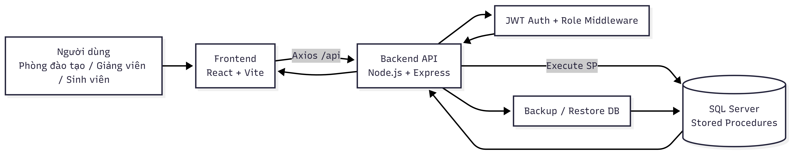
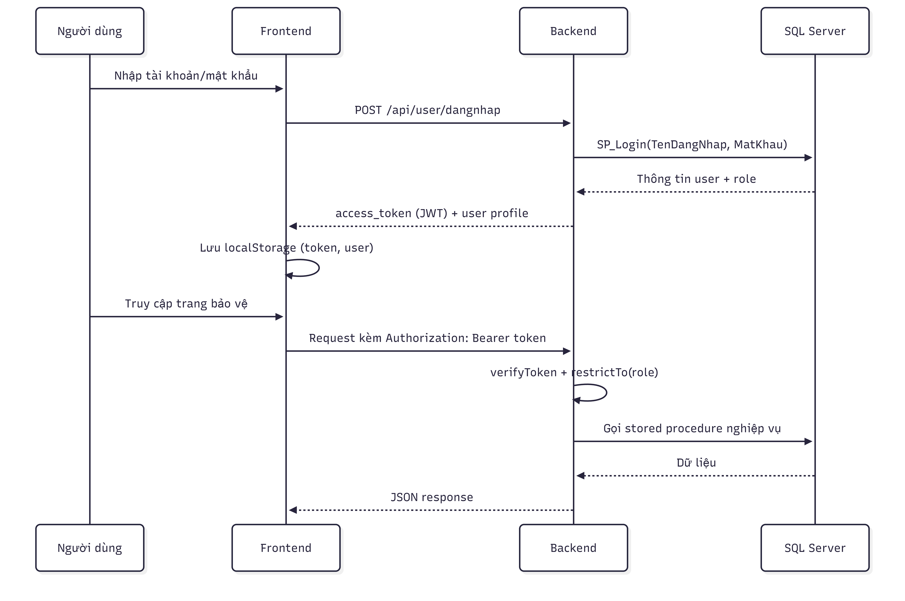
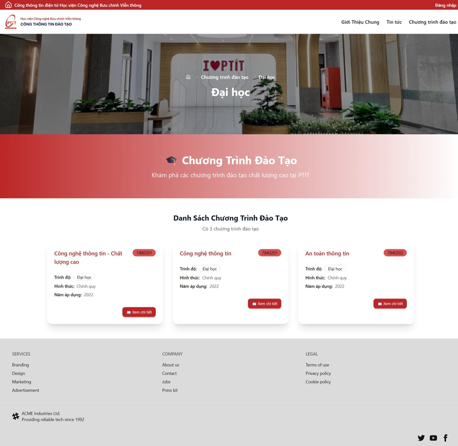
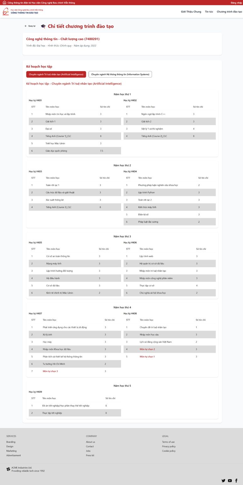
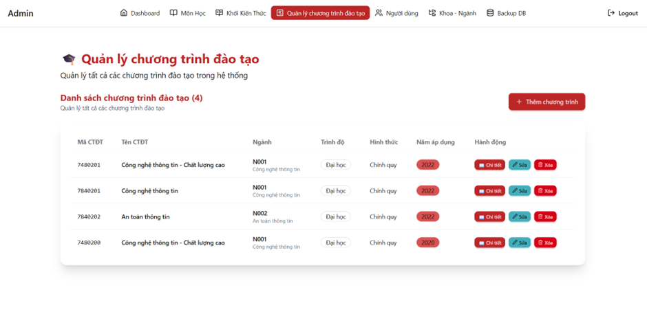
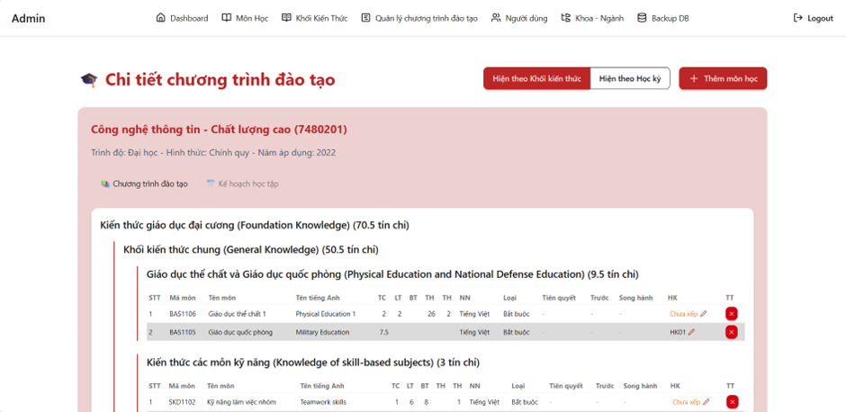
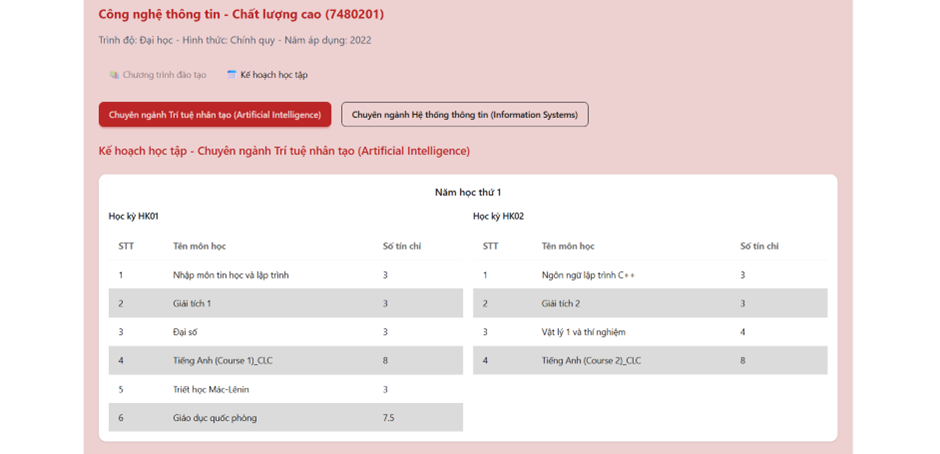
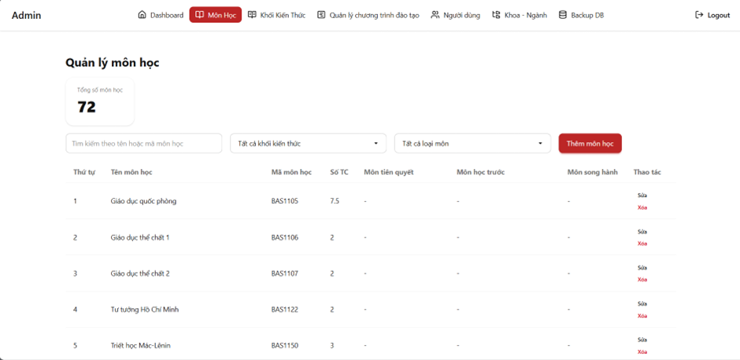

# Curriculum Management System (Hệ thống Quản lý Chương trình Đào tạo)

[🇻🇳 Tiếng Việt](README.vi.md) | [🇺🇸 English](README.md)

> This is a project for the course **Basic Internship - Year 3 Semester 2**.

A curriculum management system (CMS) for faculties/universities, supporting: Academic Departments, Lecturers, and Students.

The project is built as a Fullstack application:

- **Frontend:** React + Vite
- **Backend:** Node.js + Express
- **Database:** Microsoft SQL Server (using Stored Procedures)

## Reports and References

- Project Report: [Google Drive Link](https://drive.google.com/file/d/1oFmjT4bAaYwDqLGk-fLZmSsz6ONLyEco/view?usp=sharing)
- Presentation Slides: [Google Drive Link](https://drive.google.com/file/d/1GfkMBf9k-FEnnSyqTp2cNHxnVoax0AQY/view?usp=sharing)
- Reference Curriculum (IT Faculty): [Google Drive Link](https://drive.google.com/file/d/1IKx06HHP7MkWu-2AFf_dZ2p5HW_y4cFw/view?usp=sharing)

## 1. Project Introduction

This project simulates a real-world curriculum management problem:

- Manage Faculties, Majors, Knowledge Blocks, and Courses.
- Manage Curriculums based on application year.
- Assign courses to semesters within a curriculum.
- User management and role-based access control.
- Dashboard with statistics for the Academic Department.
- System-level database backup/restore features.

**Academic Objectives:**

- Implement an API client-server architecture.
- Work with SQL Server and Stored Procedures.
- Deploy JWT authentication and role-based authorization.
- Organize source code using MVC (backend) and service-based API (frontend).

## 2. Key Features by Role

### Academic Department (Admin)

- Manage admin accounts.
- CRUD operations for Faculties, Majors, Knowledge Blocks, Courses, Lecturers, and Students.
- Manage Curriculums and semester details.
- View statistical dashboards.
- Perform database backup/restore.

### Lecturers

- System login.
- View personal profile.
- View assigned teaching courses.
- Change password.

### Students

- System login.
- View personal profile.
- View personal curriculum (and related curriculums by year).
- View knowledge blocks and courses within the program.
- Change password.

## 3. Architecture and Folder Structure

```text
QuanLyChuongTrinhDaoTao/
|- be/            # Backend API (Express + MSSQL)
|- fe/            # Frontend UI (React + Vite)
|- db_dump.sql    # DB initialization script + sample data + stored procedures
|- github-assets/ # Demo images for README/GitHub
```

**Backend (`be/`)** follows the MVC pattern:

- `controllers/`: Handles requests/responses.
- `models/`: Interacts with SQL Server.
- `routes/`: Endpoint declarations.
- `middleware/`: JWT auth and role authorization.
- `config/database.js`: DB connection configuration.

**Frontend (`fe/`)** organization:

- `pages/`: Admin, User, and Home pages.
- `api/services/`: API calls categorized by business logic.
- `routes/ProtectedRoute.jsx`: Role-based route protection.

## 4. Technologies Used

### Frontend

- React 19, Vite 6, React Router
- Axios, Tailwind CSS 4 + DaisyUI
- Framer Motion, Lucide React

### Backend

- Node.js, Express 5
- `mssql`, `jsonwebtoken` (JWT), `dotenv`, `cors`

### Database

- Microsoft SQL Server
- Stored Procedures (Login, CRUD, Dashboard, Backup/Restore, etc.)

## System Diagrams

### General Architecture



### Login and Authorization Flow



## 5. Setup and Installation

### Prerequisites

- Node.js >= 18, npm >= 9
- Microsoft SQL Server
- SQL Server Management Studio (Recommended)

### Step 1: Initialize Database

1. Open SQL Server Management Studio.
2. Create a new database named: `QLChuongTrinhDaoTao`.
3. Execute the `db_dump.sql` file to create tables, sample data, and stored procedures.

### Step 2: Configure Backend

In the `be/` directory, create/edit the `.env` file:

```env
DB_USER=sa
DB_PASSWORD=your_password
DB_SERVER=localhost
DB_DATABASE=QLChuongTrinhDaoTao
DB_PORT=1433
PORT=3000
```

_Note: The JWT secret is currently hard-coded as `ttcs` for demonstration._

### Step 3: Install Dependencies

Run the following commands:

```bash
cd be
npm install

cd ../fe
npm install
```

### Step 4: Run Backend

```bash
cd be
npm run dev
```

Default backend: `http://localhost:3000`

### Step 5: Run Frontend

```bash
cd fe
npm run dev
```

Default frontend: `http://localhost:5173` (configured to point to the backend API in `fe/src/api/config/apiClient.js`).

## 6. Sample Accounts

Sample data in `db_dump.sql` includes:

- **Academic Department (Admin)**
  - Username: `admin` | Password: `admin`
- **Lecturer**
  - Username: `GV001` | Password: `06092025`
- **Student**
  - Username: `N001202200` | Password: `123456789`

## 7. Key APIs

- `POST /api/user/dangnhap`: Login and issue JWT.
- `GET /api/user/profile`: Fetch personal information.
- `GET /api/dashboard/*`: Statistical dashboard data.
- `POST /api/backup/database`: Backup database.
- `POST /api/backup/database/restore`: Restore database.

## 8. Author and Purpose

This project was developed for academic purposes to demonstrate a fullstack curriculum management system with role-based access control and administrative data management.

## 9. UI Demo

### Public Pages

Landing Page:


Curriculum Details (Public):


### Admin Panel

Curriculum list & details:



Management Views:


