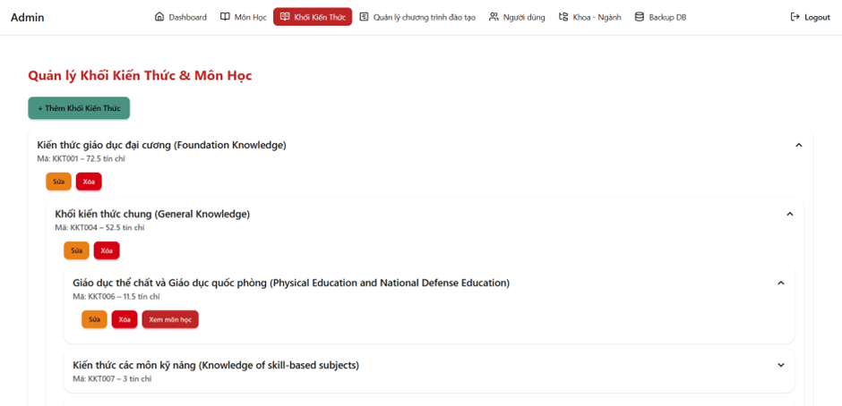

# Hệ thống Quản lý Chương trình Đào tạo

[🇻🇳 Tiếng Việt](README.vi.md) | [🇺🇸 English](README.md)

> Đây là dự án môn học **Thực tập cơ sở - Học kỳ 2 năm 3**.

Hệ thống quản lý chương trình đào tạo (CTĐT) cho khoa/trường, hỗ trợ các đối tượng: Phòng Đào tạo, Giảng viên và Sinh viên.

Dự án được xây dựng theo mô hình Fullstack:

- Frontend: React + Vite
- Backend: Node.js + Express
- Database: Microsoft SQL Server (sử dụng Stored Procedure)

## Báo cáo và tài liệu tham khảo

- Báo cáo dự án: https://drive.google.com/file/d/1oFmjT4bAaYwDqLGk-fLZmSsz6ONLyEco/view?usp=sharing
- Slide thuyết trình: https://drive.google.com/file/d/1GfkMBf9k-FEnnSyqTp2cNHxnVoax0AQY/view?usp=sharing
- Chương trình đào tạo của khoa CNTT được sử dụng làm tài liệu tham khảo và định hướng trong quá trình xây dựng dự án.: https://drive.google.com/file/d/1IKx06HHP7MkWu-2AFf_dZ2p5HW_y4cFw/view?usp=sharing

## 1. Giới thiệu đồ án môn học

Dự án mô phỏng bài toán quản lý chương trình đào tạo trong thực tế:

- Quản lý Khoa, Ngành, Khối kiến thức, Môn học.
- Quản lý Chương trình đào tạo theo năm áp dụng.
- Gán môn học vào học kỳ trong chương trình đào tạo.
- Quản lý người dùng và phân quyền theo vai trò.
- Cung cấp dashboard thống kê cho Phòng Đào tạo.
- Hỗ trợ backup/restore database từ hệ thống.

Mục tiêu học thuật:

- Vận dụng kiến trúc API client-server.
- Làm việc với SQL Server và Stored Procedure.
- Triển khai xác thực bằng JWT và phân quyền theo role.
- Tổ chức mã nguồn theo cấu trúc MVC (backend) và service-based API (frontend).

## 2. Chức năng chính theo vai trò

### Phòng Đào tạo

- Quản lý tài khoản phòng đào tạo.
- CRUD Khoa, Ngành, Khối kiến thức, Môn học, Giảng viên, Sinh viên.
- Quản lý Chương trình đào tạo và chi tiết học kỳ.
- Xem dashboard tổng hợp thống kê.
- Thực hiện backup/restore database.

### Giảng viên

- Đăng nhập hệ thống.
- Xem thông tin cá nhân.
- Xem danh sách môn học giảng dạy.
- Đổi mật khẩu.

### Sinh viên

- Đăng nhập hệ thống.
- Xem thông tin cá nhân.
- Xem CTĐT của bản thân (và các CTĐT cùng nhóm theo năm áp dụng).
- Xem khối kiến thức, môn học trong chương trình.
- Đổi mật khẩu.

## 3. Kiến trúc và cấu trúc thư mục

```text
QuanLyChuongTrinhDaoTao/
|- be/        # Backend API (Express + MSSQL)
|- fe/        # Frontend UI (React + Vite)
|- db_dump.sql # Script khởi tạo DB + dữ liệu mẫu + stored procedures
|- github-assets/ # Ảnh demo giao diện cho README/GitHub
```

Backend (`be/`) được tổ chức theo hướng MVC:

- `controllers/`: Xử lý request/response.
- `models/`: Làm việc với SQL Server.
- `routes/`: Khai báo endpoint.
- `middleware/`: JWT auth và phân quyền role.
- `config/database.js`: Cấu hình kết nối DB.

Frontend (`fe/`) tổ chức theo module:

- `pages/`: Trang Admin/User/Home.
- `api/services/`: Gọi API theo từng nghiệp vụ.
- `routes/ProtectedRoute.jsx`: Bảo vệ route theo role.

## 4. Công nghệ sử dụng

### Frontend

- React 19
- Vite 6
- React Router
- Axios
- Tailwind CSS 4 + DaisyUI
- Framer Motion
- Lucide React

### Backend

- Node.js
- Express 5
- mssql
- jsonwebtoken (JWT)
- dotenv
- cors

### Database

- Microsoft SQL Server
- Stored Procedures (đăng nhập, CRUD, dashboard, backup/restore, ...)

## Sơ đồ hệ thống

### Kiến trúc tổng quan


### Luồng đăng nhập và phân quyền


## 5. Hướng dẫn setup và chạy dự án

### Yêu cầu môi trường

- Node.js >= 18
- npm >= 9
- Microsoft SQL Server
- SQL Server Management Studio (khuyến nghị)

### Bước 1: Khởi tạo database

1. Mở SQL Server Management Studio.
2. Tạo database mới tên: `QLChuongTrinhDaoTao` (nếu chưa có).
3. Chạy toàn bộ file `db_dump.sql` để tạo bảng, dữ liệu mẫu và stored procedure.

### Bước 2: Cấu hình backend

Trong thư mục `be/`, tạo/chỉnh sửa file `.env` theo mẫu:

```env
DB_USER=sa
DB_PASSWORD=your_password
DB_SERVER=localhost
DB_DATABASE=QLChuongTrinhDaoTao
DB_PORT=1433
PORT=3000
```

Lưu ý:

- Backend đang sử dụng `encrypt: true` và `trustServerCertificate: true` trong `be/config/database.js`.
- JWT secret hiện được hard-code trong mã nguồn là `ttcs`.

### Bước 3: Cài dependency

Chạy lần lượt:

```bash
cd be
npm install

cd ../fe
npm install
```

### Bước 4: Chạy backend

```bash
cd be
npm run dev
```

Backend mặc định: `http://localhost:3000`

### Bước 5: Chạy frontend

```bash
cd fe
npm run dev
```

Frontend mặc định: `http://localhost:5173`

Frontend đang gọi API tới `http://localhost:3000/api` tại file `fe/src/api/config/apiClient.js`.

## 6. Tài khoản mẫu để test

Dữ liệu mẫu trong `db_dump.sql` có sẵn 3 tài khoản:

- Phòng đào tạo
  - Tên đăng nhập: `admin`
  - Mật khẩu: `admin`

- Giảng viên
  - Tên đăng nhập: `GV001`
  - Mật khẩu: `06092025`

- Sinh viên
  - Tên đăng nhập: `N001202200`
  - Mật khẩu: `123456789`

## 7. Một số API tiêu biểu

- `POST /api/user/dangnhap`: Đăng nhập, cấp JWT.
- `GET /api/user/profile`: Lấy thông tin cá nhân.
- `GET /api/dashboard/*`: Dashboard thống kê (Phòng Đào tạo).
- `POST /api/backup/device`: Tạo backup device.
- `POST /api/backup/database`: Backup database.
- `POST /api/backup/database/restore`: Restore database.
- `GET /api/public/chuongtrinhdaotao`: Lấy danh sách CTĐT công khai.

## 8. Ghi chú phát triển

- Nên đổi JWT secret sang biến môi trường (`process.env.JWT_SECRET`).
- Nên hash mật khẩu (bcrypt) thay vì lưu plain text.
- Nên thêm bộ test API (unit/integration) cho các module quan trọng.

## 9. Tác giả và mục đích

Dự án phục vụ học tập/báo cáo môn học về xây dựng hệ thống quản lý chương trình đào tạo theo hướng fullstack, kết hợp quản lý dữ liệu học vụ và phân quyền người dùng.

## 10. Demo giao diện

### Trang public

Trang chủ hệ thống:


Chi tiết chương trình đào tạo (public):


### Trang quản trị (Admin)

Danh sách chương trình đào tạo:


Chi tiết chương trình đào tạo:


Quản lý kế hoạch học tập:


Quản lý khối kiến thức:



Quản lý môn học:


